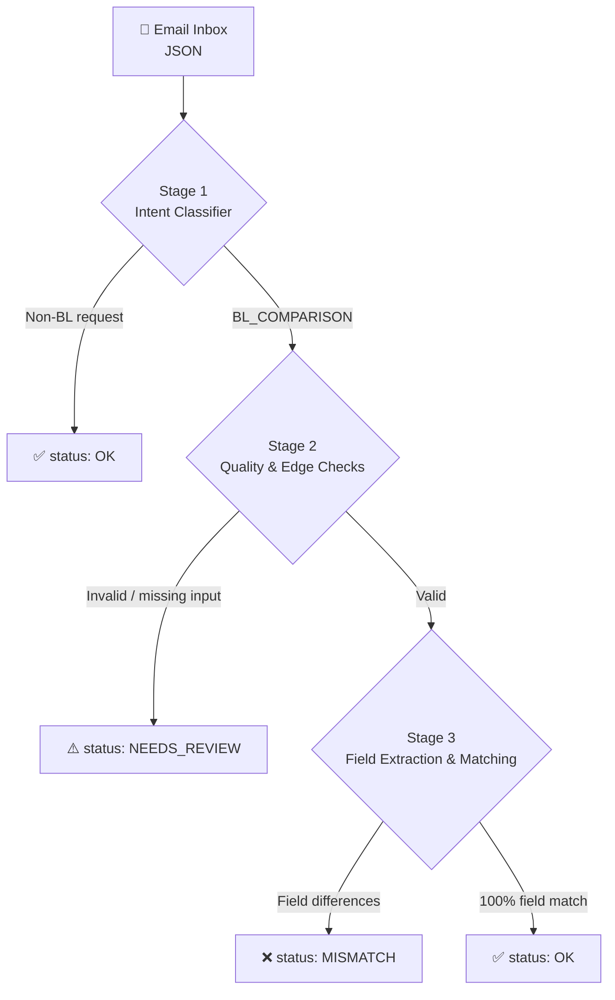

<div align="center">

# 🚢 Automated Shipping Document Verification Pipeline

**Reads the inbox, checks the paperwork, and flags only what a human needs to see.**


</div>

---

## ⚡ Quick Start

```bash
git clone https://github.com/nishtwowhoo/sdoc-shipping-document-verifier.git
cd sdoc-shipping-document-verifier
python classify.py
```

Predictions are written to `submission.json`.

---

## 📌 What is this?

Logistics operations teams receive a steady stream of emails: requests to verify a draft Bill of Lading (BL) against the Shipping Instructions (SI), invoice questions, general updates, and spam. Sorting them and cross-checking shipment details by hand is repetitive work.

This pipeline automates it. Built for the **Averis x Monash Hackathon 2026** (Shipping Document Verification use case), it:

1. Reads incoming operational emails
2. Classifies each message by intent
3. Extracts key shipment details from the SI and the draft BL
4. Compares the **7 core shipping fields**
5. Escalates edge cases to a human instead of guessing

### How it works



| Final Status | Meaning |
|---|---|
| `OK` | Non-BL request, or all 7 fields match |
| `NEEDS_REVIEW` | An edge case was detected and a human must review it |
| `MISMATCH` | One or more fields differ between the SI and the BL |

---

## 📑 Table of Contents

- [Key Capabilities](#-key-capabilities)
- [Getting Started](#-getting-started)
- [Project Structure](#-project-structure)
- [Tech Stack](#-tech-stack)

---

## 🎯 Key Capabilities

### 1️⃣ Intent Classification (Stage 1)

Every email is sorted into one of five operational buckets:

| Intent | Description |
|---|---|
| `BL_COMPARISON` | Requests to verify a draft Bill of Lading against Shipping Instructions |
| `SI_REQUEST` | Requests to issue or prepare new Shipping Instructions |
| `INVOICE_QUERY` | Billing, tax invoice, or payment-related inquiries |
| `GENERAL` | Standard operational correspondence and updates |
| `SPAM` | Unsolicited promotional or irrelevant emails |

### 2️⃣ Edge-Case Escalation (Stage 2)

> **What does `NEEDS_REVIEW` mean?**
> The pipeline could not safely compare the documents, so it hands the case to a person (Human-in-the-Loop) with an explicit reason code instead of producing a wrong answer.

| Reason Code | Trigger |
|---|---|
| `wrong_doc_type` | Attachment is a Commercial Invoice, Packing List, or other non-BL file |
| `missing_attachment` | Comparison requested, but the draft BL is missing |
| `unreadable` | File is corrupted, garbled, or empty |
| `missing_value` | SI contains unpopulated placeholders (`???`, `_______`, `TBA`, `N/A`) |

### 3️⃣ Field Extraction & Discrepancy Matching (Stage 3)

Label variations are normalized (e.g. *Port of Loading* ↔ *POL*, *Consignee* ↔ *To the Order of*) before the **7 required fields** are compared:

| # | Field |
|---|---|
| 1 | `shipper` |
| 2 | `consignee` |
| 3 | `notify_party` |
| 4 | `port_of_loading` |
| 5 | `port_of_discharge` |
| 6 | `container_count` |
| 7 | `gross_weight_kg` |

When fields differ, the output includes an exact side-by-side mismatch list with `status: "MISMATCH"`.

---

## 🚀 Getting Started

### Prerequisites

- Python **3.10+**

### Installation & Run

**1. Clone the repository**

```bash
git clone https://github.com/nishtwowhoo/sdoc-shipping-document-verifier.git
cd sdoc-shipping-document-verifier
```

**2. Run the classification & verification pipeline**

```bash
python classify.py
```

**3. Inspect the predictions**

Results are written to `submission.json`, following the required evaluation schema (see `sample_submission.json`).

---

## 🗂️ Project Structure

```text
.
├── classify.py             # Main entry point: runs all three stages
├── loader.py               # Loads the input data
├── sample_submission.json  # Reference output schema
└── submission.json         # Generated predictions
```

---

## 💻 Tech Stack

| Category | Details |
|---|---|
| **Language** | Python 3 |
| **Libraries** | `json`, `re` (regular expressions), `os`, plus the local `loader.py` module |
| **Data Format** | JSON, matching the `sample_submission.json` schema |