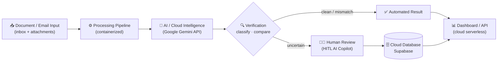
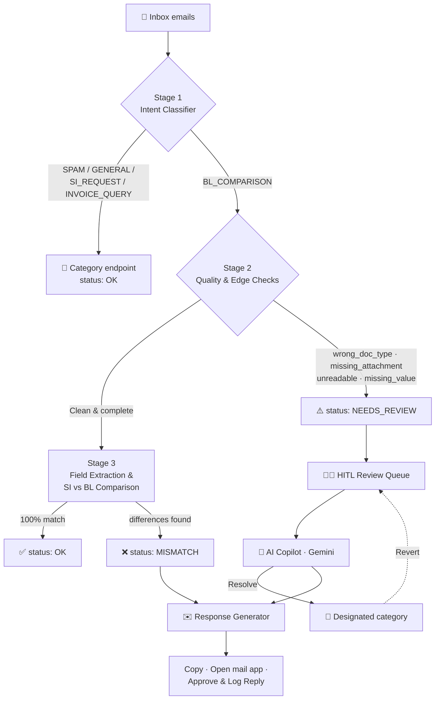

<div align="center">

# 🚢 Waybill Copilot

### A Cloud-Native, AI-Powered Shipping Document Verifier

**Reads the shipping inbox, verifies the paperwork with AI, and drafts the reply for every problem it finds — with a human in the loop.**


</div>

---

## 👥 Team Members

| Name | Role | GitHub |
|---|---|---|
| Aniq Naf'an | Team Lead | [@aniqqnafan](https://github.com/aniqqnafan) |
| Danish Firdaus | Backend / AI | [@nishtwowhoo](https://github.com/nishtwowhoo) |
| Izzul Zaqwan | Frontend / Dashboard | [@izzullun](https://github.com/izzullun) |
| Hanna Dania | Documentation | [@hannadania](https://github.com/hannadania) |
| Wan Adam Haikal | Documentation | [@dambeepbeep](https://github.com/dambeepbeep) |

---

## 📑 Table of Contents

- [Introduction](#-introduction)
- [Features](#-features)
- [Problem Faced & Who It Affects](#-problem-faced--who-it-affects)
- [Technical Architecture](#-technical-architecture)
- [Implementation Details](#-implementation-details)
- [Technology Stack](#-technology-stack)
- [Cloud-Native Architecture & Deployment](#-cloud-native-architecture--deployment)
- [Challenges Faced](#-challenges-faced)
- [Future Roadmap](#-future-roadmap)
- [Quick Start](#-quick-start)
- [License](#-license)

---

## 📌 Introduction

**Waybill Copilot** is a **cloud-native, AI-powered shipping document verifier** built for the **Averis x Monash Hackathon 2026**. It automates the slow, manual work of reading shipping emails and checking their paperwork.

Shipping teams receive a constant stream of emails carrying **Shipping Instructions (SI)**, **Draft Bills of Lading (BL)**, invoices, and supporting documents. Verifying each one by hand — identifying the email's purpose, finding the right attachments, and cross-checking key fields between the SI and the BL — is repetitive and error-prone.

Waybill Copilot handles this end to end. It uses **cloud-based AI (the Google Gemini API)** to classify each email and extract the important fields, then compares the SI against the draft BL and flags any discrepancies. When the AI isn't confident or a document can't be processed, the case is sent to a **human-in-the-loop (HITL)** review workspace, where an operator makes the final call with AI assistance. This combination of automation and human oversight keeps verification both fast and reliable.

Because it's built as a **cloud-native application** — containerized with Docker, deployed to a serverless cloud platform, and backed by a managed cloud database — it's accessible from any browser and ready to scale with real shipping workloads.

---

## ✨ Features

- **📥 Email & document processing** — ingests shipping emails and their attachments (TXT, PDF, DOCX, XLSX).
- **🏷️ AI document classification** — sorts each email by intent: `BL_COMPARISON`, `SI_REQUEST`, `INVOICE_QUERY`, `GENERAL`, or `SPAM`.
- **📄 Data extraction** — pulls the 7 core shipping fields (Shipper, Consignee, Notify Party, Port of Loading, Port of Discharge, Container Count, Gross Weight) from documents.
- **🔍 Document comparison** — compares the SI against the draft BL field by field and detects exact discrepancies.
- **🤖 AI-assisted verification** — uses the Google Gemini API for classification and extraction, with a deterministic rule-engine fallback for reliability.
- **🧑‍💻 Human-in-the-loop review** — uncertain cases (`NEEDS_REVIEW`) go to an AI Copilot workspace where operators review, resolve, or revert.
- **⚠️ Confidence & error identification** — flags `MISMATCH` (found discrepancies) and `NEEDS_REVIEW` (edge cases such as missing, unreadable, or wrong documents) with explicit reason codes.
- **✉️ One-click response generator** — auto-drafts amendment requests (to carriers) and follow-up requests (to clients) that operators approve and log.
- **📊 Dashboard / web interface** — a browser dashboard with KPI cards, filters, an SI-vs-BL diff view, and a scorecard.
- **🔌 Backend / API** — HTTP/JSON endpoints powering the dashboard, HITL copilot, and response engine, served as cloud serverless functions.

---

## 🔎 Problem Faced & Who It Affects

### The Problem

Manually verifying shipping documents means reading every email, working out what it's asking for, opening the attachments, extracting the key fields, comparing them across documents, spotting discrepancies, deciding what to do, and writing a reply. Done at volume, this leads to:

- **Time-consuming verification** — hours lost to repetitive document checks.
- **Costly errors** — small mismatches in consignee names, ports, container counts, or weights slip through and cause downstream delays.
- **Problem documents** — missing draft BLs, corrupt or unreadable files, and incomplete forms stall the process.
- **Repetitive communication** — staff rewrite the same amendment and follow-up emails over and over.

### Who It Affects

| Group | Impact | How Waybill Copilot helps |
|---|---|---|
| **Logistics / operations teams** | Spend their day processing emails and chasing discrepancies | Automates classification, comparison, and reply drafting |
| **Shipping / documentation staff** | Must manually compare SI vs BL and request corrections | Gets exact, auto-generated amendment requests |
| **Reviewers / managers** | Need consistency and visibility over open cases | Gains a HITL review queue, a clear dashboard, and an audit log |
| **Clients & carriers** | Wait on corrections or must resend documents | Receive fast, specific follow-ups stating exactly what's needed |

By combining **AI-assisted automation** with **human review** in a **cloud-native workflow**, the project removes the repetitive manual work while keeping people in control of the decisions that matter.

---

## 🏗️ Technical Architecture

Waybill Copilot follows a **cloud-native application architecture**: a containerized processing pipeline feeds a serverless cloud backend, which combines cloud AI with human review and serves results to a web dashboard.



The same pipeline runs in two forms: locally/in a container to compute results, and as **cloud serverless functions** that serve those results to the browser with live human-review data from the cloud database.

### Processing pipeline



---

## 🛠️ Implementation Details

The repository is the source of truth. Here's how the main pieces fit together.

### Project structure

```text
sdoc-shipping-document-verifier/
├── inbox/                    # Inbound email records (JSON)
├── attachments/              # Document attachments (TXT, PDF, DOCX, XLSX)
├── api/                      # Cloud serverless functions (dashboard + JSON API)
│   ├── _lib/sdoc.py          # Snapshot-backed app + HTTP helpers
│   ├── _snapshot/            # Precomputed pipeline output (committed)
│   └── *.py                  # One function per route
├── scripts/
│   └── build_snapshot.py     # Builds api/_snapshot/snapshot.json
├── tests/                    # Test fixtures + runner
├── loader.py                 # Inbox data loader (local files or HTTP)
├── classify.py               # Hybrid AI + rule intent classifier & field extractor
├── comparator.py             # SI↔BL comparison & status logic
├── extractor.py              # 7-field extraction, label aliases, normalization
├── formats.py                # Attachment readers (txt/pdf/docx/xlsx) → text
├── scoring.py                # Hackathon scoring module
├── hitl.py                   # Gemini HITL copilot + Supabase/local store
├── actions.py                # Response generator + approved-reply log
├── webui.py                  # Web dashboard (dependency-free http.server)
├── main.py                   # CLI: generate / evaluate / run
├── Dockerfile                # Container build (port 8081)
├── vercel.json               # Serverless routes + function config
└── requirements.txt          # Build-time parsing deps (pypdf, python-docx, openpyxl)
```

### How it works

- **Document processing pipeline** — `loader.py` reads emails and attachments; `formats.py` converts each attachment to plain text (returning `unreadable` for corrupt/empty/image-only files).
- **Classification** — `classify.py` classifies intent using the **Gemini API** first, falling back to a deterministic rule engine so local runs stay fast and reproducible.
- **Data extraction** — `extractor.py` maps the 7 fields to their many label aliases (e.g. *Port of Loading* / *POL* / *Load Port*), drops placeholder values, and normalizes values for comparison.
- **Comparison & verification** — `comparator.py` detects the document kind, escalates edge cases to `NEEDS_REVIEW` with a reason code, and compares SI vs BL field by field to produce `OK` or `MISMATCH` plus the exact `defect_fields`.
- **AI integration** — `hitl.py` calls the **Google Gemini API** directly over REST (with retry/backoff) to generate a diagnosis, suggested fix, and follow-up answers for `NEEDS_REVIEW` cases.
- **HITL workflow & database** — human resolutions are stored in **Supabase** (the `hitl_reviews` table, with a local JSON fallback) and applied as overrides on top of the base pipeline output; reverting deletes the override.
- **Response generation** — `actions.py` builds deterministic amendment/follow-up drafts from pipeline facts and logs approved replies (Supabase `hitl_actions` or local file).
- **Backend / API** — `webui.py` serves the dashboard and JSON endpoints locally or in Docker; `api/*.py` exposes the same functionality as cloud serverless functions.
- **UI** — `webui.py` renders a dependency-free dashboard with switchable modern/classic themes, the HITL AI card, and the response-engine card.

---

## 💻 Technology Stack

| Category | Technology | Purpose |
|---|---|---|
| **Application** | Python 3.12+ | Core application & pipeline |
| **AI** | Google Gemini API | AI-powered classification, extraction & HITL analysis |
| **Backend** | Python `http.server` + serverless functions (`api/`) | Application services & JSON API |
| **Frontend** | Dependency-free Web UI (`webui.py`) | User interaction & dashboard |
| **Database** | Supabase (hosted Postgres) | HITL / review & action-log data |
| **Document Processing** | pypdf · python-docx · openpyxl | PDF / DOCX / XLSX text extraction |
| **Containerization** | Docker | Application packaging |
| **Cloud** | Vercel (serverless) + cloud AI/database | Cloud-native application infrastructure |

---

## ☁️ Cloud-Native Architecture & Deployment

Waybill Copilot is built as a **cloud-native application**, using cloud services for AI, data, and hosting:

- **☁️ Cloud-based AI** — document analysis runs on the **Google Gemini API**, consumed as a managed cloud service.
- **📦 Containerized components** — the application is packaged as a **Docker** container, so it runs consistently anywhere.
- **🔌 Stateless / API-based design** — the serving layer is stateless; mutable review data lives in an external cloud database, letting the app scale and redeploy freely.
- **🌐 Web-based accessibility** — the dashboard is reachable from any browser, no install required.
- **🚀 Cloud deployment** — the app is deployed as **serverless cloud functions (Vercel)** that serve a precomputed snapshot, keeping responses fast.
- **🗄️ Managed cloud database** — **Supabase** stores HITL resolutions and approved replies, so state is durable and shared.
- **📈 Scalable architecture** — because the serving tier is stateless and containerized, it scales horizontally as inbox volume grows.

Together these give the project a practical cloud-native foundation without unnecessary operational complexity.

---

## 🚧 Challenges Faced

- **Processing different document formats** — reliably reading TXT, PDF, DOCX, and XLSX attachments, and detecting corrupt, empty, or image-only files.
- **Extracting reliable information** — handling the same field across many label variations and normalizing values before comparison.
- **AI classification & verification** — getting consistent, accurate results from the LLM and pairing it with a rule-engine fallback for reliability.
- **Handling uncertain AI results** — escalating ambiguous cases to `NEEDS_REVIEW` instead of guessing.
- **Human-in-the-loop integration** — letting operators resolve and revert reviews while keeping base pipeline output intact.
- **API / cloud service integration** — calling the Gemini API and Supabase over REST with retries and graceful fallbacks.
- **Deployment & reliability** — serving the app from a stateless, read-only serverless environment by precomputing a snapshot and externalizing state.

---

## 🗺️ Future Roadmap

The following are **planned future improvements**, not yet implemented:

- **🔹 Improved AI accuracy** — better extraction and classification on complex document layouts.
- **🔹 More document formats** — Commercial Invoices, Packing Lists, Arrival Notices, and scanned/OCR documents.
- **🔹 More automated verification** — expand the checks the pipeline can complete on its own.
- **🔹 Enhanced cloud scalability** — event-driven ingestion and autoscaling on a managed container platform.
- **🔹 Better monitoring & logging** — operational metrics and centralized observability.
- **🔹 Improved authentication & security** — role-based access and secure API management.
- **🔹 More advanced analytics** — track mismatches, reviews, common errors, and processing time.
- **🔹 Logistics / shipping system integration** — connect directly to email and shipping platforms.

---

## ⚡ Quick Start

### 🔗 Try the live product

The dashboard is deployed as a **cloud serverless app** — no setup needed:

**👉 https://your-project-name.vercel.app**

### 🛠️ Run it locally

**Prerequisites**
- Python **3.12+**
- Docker (optional)
- A [Google Gemini API key](https://aistudio.google.com/apikey)

**1. Clone the repository**

```bash
git clone https://github.com/nishtwowhoo/sdoc-shipping-document-verifier.git
cd sdoc-shipping-document-verifier
```

**2. Configure your environment**

Create a `.env` file in the project root:

```env
GEMINI_API_KEY=your_api_key_here
# Optional cloud database (falls back to local JSON when unset):
SUPABASE_URL=https://your-project.supabase.co
SUPABASE_KEY=your_anon_or_service_key
```

> ⚠️ Never commit `.env`. It is already listed in `.gitignore`.

**3. Generate predictions (optional)**

```bash
python main.py generate --data-dir . --out submission.json
# or
python classify.py
```

**4. Launch the dashboard**

```bash
# Directly
python webui.py                 # http://127.0.0.1:8081

# Or in Docker (cloud-native container)
docker build -t waybill-copilot .
docker run -p 8081:8081 -e GEMINI_API_KEY=your_key waybill-copilot
```

---

## 📄 License

This project was developed for the **Averis x Monash Hackathon 2026**.