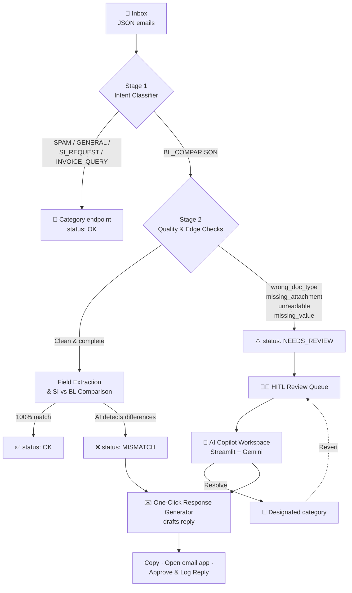

<div align="center">

# 🚢 Waybill Copilot 

# An Automated Shipping Document Verification Pipeline

**Reads the shipping inbox, verifies the paperwork, and drafts the reply for every problem it finds.**


</div>

---

## 👥 Team Members

| Name | Role | GitHub |
|---|---|---|
| Aniq Naf'an | Team Lead | [@aniqqnafan](https://github.com/aniqqnafan) |
| Danish Firdaus | Backend / AI | [@nishtwowhoo](https://github.com/nishtwowhoo) |
| Izzul Zaqwan | Frontend / Dashboard | [@izzullun](https://github.com/izzullun) |
| Hanna Dania | Documentation | [@hannadania](https://github.com/hannadania) |
| Wan Adam Haikal | Documentation | [@dambeepbeep](https://github.com/dambeepbeep) |

---

## 📑 Table of Contents

- [Team Members](#-team-members)
- [Introduction](#-introduction)
- [Features](#-features)
- [Problem Faced & Who It Affects](#-problem-faced--who-it-affects)
- [Technical Architecture](#-technical-architecture)
- [Implementation Details](#-implementation-details)
- [Challenges Faced](#-challenges-faced)
- [Future Roadmap](#-future-roadmap)
- [Quick Start](#-quick-start)
- [License](#-license)

---

## 📌 Introduction

Shipping operations involve handling a large number of emails and documents, including Shipping Instructions (SI), Draft Bills of Lading (BL), invoices, and other supporting documents.

Manually reviewing these documents can be time-consuming and prone to human error, especially when operators need to identify discrepancies between multiple documents.

The **Waybill Copilot** was built for the **Averis x Monash Hackathon 2026** to automate this verification process. Rather than only displaying an error on screen, the system acts as an active operational copilot: it reads the shipping inbox, verifies the paperwork, and drafts the reply for every problem it finds.

The system:

1. **Classifies** incoming emails by intent
2. **Validates** attachment availability and readability
3. **Extracts** the 7 core shipping fields: Shipper, Consignee, Notify Party, Port of Loading, Port of Discharge, Container Count, and Gross Weight
4. **Compares** the Shipping Instructions (SI) against the Draft Bill of Lading (BL)
5. **Flags** two kinds of problems — `MISMATCH` (the AI found the problem itself) and `NEEDS_REVIEW` (the AI can't complete the check, so a human reviews it in the HITL AI Copilot workspace)
6. **Drafts** a context-specific reply the operator can approve in one click

---

## ✨ Features

### Stage 1: Email Intent Classifier (`classify.py`)

Ingests raw email JSON objects and sorts each one into a category:

| Intent | Description |
|---|---|
| `BL_COMPARISON` | Requests to verify a draft Bill of Lading against Shipping Instructions |
| `SI_REQUEST` | Requests to issue or prepare new Shipping Instructions |
| `INVOICE_QUERY` | Billing, tax invoice, or payment-related inquiries |
| `GENERAL` | Standard operational correspondence and updates |
| `SPAM` | Unsolicited promotional or irrelevant emails |

### Stage 2: Quality & Edge Checks

Validates attachment availability and readability. Clean, complete emails continue to field extraction. Anything the pipeline can't handle on its own is set to `NEEDS_REVIEW` with an explicit reason code:

| Reason Code | Trigger |
|---|---|
| `wrong_doc_type` | Attachment is a Commercial Invoice, Packing List, or other non-BL file |
| `missing_attachment` | Comparison requested, but the draft BL is missing |
| `unreadable` | File is corrupted, garbled, or empty |
| `missing_value` | SI contains unpopulated placeholders (`???`, `_______`, `TBA`, `N/A`) |

For clean cases, label variations are normalized (e.g. *Port of Loading* ↔ *POL*) and the 7 fields are compared.

### Stage 3: Field Extraction, Comparison & Category Endpoints (`app.py`, `ai_copilot.py`)

| Final Status | Meaning | Next step |
|---|---|---|
| `OK` | Non-BL request, or all 7 fields match | Routed to its category endpoint |
| `MISMATCH` | The AI detected the problem: one or more fields differ between SI and BL, shown as an exact side-by-side list | Response Generator drafts an amendment request |
| `NEEDS_REVIEW` | The pipeline can't complete the check on its own (edge case) | HITL Review Queue and AI Copilot |

- **Direct categories:** emails that don't need review are routed to their category endpoint (Spam, SI request, BL request, etc.).
- **`MISMATCH`:** goes straight to the Response Generator, because the problem is already identified.
- **`NEEDS_REVIEW`:** goes to the AI Copilot workspace.

### 🤖 HITL AI Copilot

An interactive Streamlit dashboard where operators work through `NEEDS_REVIEW` emails, powered by the **Google Gemini API**.

| Feature | What it does |
|---|---|
| **🔍 AI Diagnosis** | Analyzes a flagged email and explains the issue to the operator in plain language |
| **💡 AI Solution Recommendation** | Suggests the next action and generates a pre-populated reply draft |
| **✅ Resolve** | The operator categorizes the email; clicking *Resolve* moves it to its designated area |
| **↩️ Revert** | Undoes a human mistake and restores the email to its review state |

### ✉️ One-Click Email Response Generator (HITL Action Engine)

Instead of only displaying an error, the system gives the operator a ready-to-use reply. The draft depends on the type of flag:

| Flag | Recipient | What the draft contains |
|---|---|---|
| `MISMATCH` | Shipping carrier | A pre-populated **amendment request** listing the exact discrepancies (e.g. asking for the draft BL's Consignee to be corrected to match the SI) |
| `NEEDS_REVIEW` (missing attachment / edge case) | Client | An instant **follow-up** requesting the missing draft BL or required document |

Each draft comes with three action buttons:

| Button | What it does |
|---|---|
| 📋 **Copy the email** | Copies the drafted email so it can be pasted anywhere |
| 📧 **Open email app** | Opens the draft in the operator's email app |
| ✅ **Approve & Log Reply** | Approves the draft and logs the reply |

The operator always reviews the draft before anything goes out. By generating context-specific replies automatically, the feature reduces the manual handling time needed per email.

---

## 🔎 Problem Faced & Who It Affects

### The Problem

A typical verification process may require an operator to read an incoming email, determine its purpose, locate the relevant attachments, open and inspect the documents, identify important shipping fields, compare information across documents, identify discrepancies, determine the appropriate action, and write a response to the relevant party. Performing these steps manually creates several operational problems:

- **Manual verification** — operators need to repeatedly inspect documents and compare information by hand.
- **Human error** — small differences in fields such as consignee names, ports, container counts, or gross weight can be overlooked.
- **Missing or unreadable documents** — a verification request may not contain the required Draft BL, or the provided file may be corrupted, empty, or unreadable.
- **Repetitive communication** — operators may need to repeatedly write similar amendment requests or follow-up emails.
- **Uncertain cases** — not every document can be safely processed automatically; some cases require human judgement.

### Who Does It Affect?

| Group | Impact |
|---|---|
| **Shipping Operations Teams** | Spend time processing emails, reviewing documents, identifying discrepancies, and communicating with clients or carriers |
| **Shipping Carriers** | May receive amendment requests when discrepancies are found between the SI and Draft BL |
| **Clients** | May need to provide missing documents or correct incomplete information before the shipping process can continue |
| **Operations Managers** | Large volumes of manual processing make it harder to maintain consistent workflows and monitor unresolved cases |

---

## 🏗️ Technical Architecture

```text
inbox/ + attachments/  ──►  loader.py  ──►  classify.py (Stages 1–3)  ──►  submission.json
   (emails & documents)     (loads data)    (classify, check, compare)      (final statuses)
```

`loader.py` reads the email records from `inbox/` and their documents from `attachments/`. `classify.py` then runs all three stages on each email and writes the final status of every email to `submission.json`, following the schema in `sample_submission.json`. `classify.py` loads your `.env` automatically on startup.



### AI Copilot Workflow

```text
NEEDS_REVIEW
      │
      ▼
AI Diagnosis
      │
      ▼
Solution Recommendation
      │
      ▼
Operator Review
      │
 ┌────┴────┐
 ▼         ▼
Resolve   Revert
 │         │
 ▼         └──► Review Queue
Category
```

The AI assists the operator, but the final action remains under human control.

### Response Generation

```text
MISMATCH
   │
   ▼
Amendment Request
   │
   ▼
Shipping Carrier

NEEDS_REVIEW
   │
   ▼
Follow-up Request
   │
   ▼
Client
```

---

## 🛠️ Implementation Details

### Project Structure

```text
sdoc-shipping-document-verifier/
├── attachments/            # Document attachments (PDF, DOCX, XLSX, TXT)
├── inbox/                  # Inbound email records (JSON)
├── .gitignore              # Keeps secrets such as .env out of Git
├── classify.py             # Stage 1 classifier & Stage 2/3 extraction engine
├── loader.py               # Inbox data loader helper
├── sample_submission.json  # Submission schema specification
├── submission.json         # Generated evaluation output
└── README.md               # Project documentation
```

### Core Components

- **`loader.py`** — reads email records from `inbox/` and their associated documents from `attachments/`.
- **`classify.py`** — the main processing engine: handles email classification, document validation, field extraction, SI vs. Draft BL comparison, and final status generation. Writes `submission.json` according to the schema in `sample_submission.json`.
- **`app.py`** — provides the Streamlit dashboard used by operators to interact with the system.
- **`ai_copilot.py`** — provides the AI-powered Human-in-the-Loop workspace using the Google Gemini API, assisting operators with cases marked `NEEDS_REVIEW`.

### 💻 Technology Stack

| Category | Details |
|---|---|
| **Language** | Python 3.11 / 3.12+ |
| **Document Processing** | pypdf (PDF), python-docx (DOCX), openpyxl (XLSX) |
| **AI / LLM** | Google Gemini API (`hitl.py`) |
| **Dashboard** | Streamlit (`webui.py`) |
| **Deployment** | Docker (Dockerfile, Python 3.11-slim) + Vercel serverless (`api/`, stdlib-only prebuilt snapshot) |
| **Data Storage** | Supabase (`hitl_reviews` table), with local JSON fallback (`hitl_overrides.json`) |
 
---

## 🚧 Challenges Faced

### 1. Handling Different Document Conditions

Real-world documents don't always follow the expected format, so the system has to account for missing attachments, incorrect document types, unreadable or empty files, missing values, and different field-naming conventions.

### 2. Balancing Automation and Human Oversight

Fully automating document verification can be risky when the system cannot confidently determine the correct result. Uncertain cases are classified as `NEEDS_REVIEW` and sent to the HITL AI Copilot, allowing automation for straightforward cases while keeping an operator involved when human judgement is required.

### 3. Extracting Consistent Information

The same shipping field can appear under different names — for example, *Port of Loading*, *POL*, and *Loading Port* — so the system normalizes these variations before performing comparisons.

### 4. Generating Useful Responses

Simply identifying a mismatch isn't enough for an operational workflow; the system also needs to produce a response that clearly explains what needs to be corrected or what document needs to be provided.

### 5. Integrating AI into an Operational Workflow

The AI component needs to support the operator rather than replace them. The system separates AI detection → AI recommendation → human review → final action, providing a controlled workflow for cases where automated verification is uncertain.

---

## 🗺️ Future Roadmap

The current implementation provides the core document verification and HITL workflow. Future development could expand the system in several areas:

- **🔹 Email System Integration** — connect directly to an email platform so incoming emails are processed automatically rather than relying on local inbox data.
- **🔹 Broader Document Support** — expand processing to support additional shipping documents and formats, such as Commercial Invoices, Packing Lists, Arrival Notices, and other shipping-related documentation.
- **🔹 Advanced OCR** — improve extraction from scanned or image-based documents using more advanced OCR capabilities.
- **🔹 Improved AI Verification** — enhance the AI verification layer to handle more complex document structures and inconsistencies.
- **🔹 Audit & Analytics** — introduce operational analytics to track processed emails, mismatches, human reviews, common document errors, and response processing time.
- **🔹 Production Deployment** — move from a local Docker-based deployment toward a production environment with authentication, role-based access, centralized logging, monitoring, secure API management, and scalable infrastructure.

---

## ⚡ Quick Start
### 🔗 Try the live product
 
The dashboard is deployed on Vercel — no setup needed, just open it:
 
**👉 https://your-project-name.vercel.app**
 
The Next.js frontend calls the Python verification logic through API routes, so the inbox, HITL Copilot, and Response Generator all work directly in the browser.
 
### 🛠️ Run it locally (optional, for development)
 
If you'd rather run the project on your own machine:
 
**Prerequisites**
- Python **3.12+**
- Docker and Docker Compose
- A [Google Gemini API key](https://aistudio.google.com/apikey)

### 1. Clone the repository

```bash
git clone https://github.com/nishtwowhoo/sdoc-shipping-document-verifier.git
cd sdoc-shipping-document-verifier
```

### 2. Configure your environment

Create a `.env` file in the project root:

```env
GEMINI_API_KEY=your_api_key_here
```

> ⚠️ Never commit `.env` to GitHub. Make sure it is listed in `.gitignore`.

### 3. Generate predictions (optional)

Run the classification & verification pipeline on its own. Output is written to `submission.json`, following the schema in `sample_submission.json`.

```bash
python classify.py
```

### 4. Launch the dashboard locally

```bash
docker compose up --build
```

Then open **http://localhost:8080** in your browser.

---

## 📄 License

This project was developed for the **Averis x Monash Hackathon 2026**.

Slide Deck: https://canva.link/i01a79dcvw0u49t
